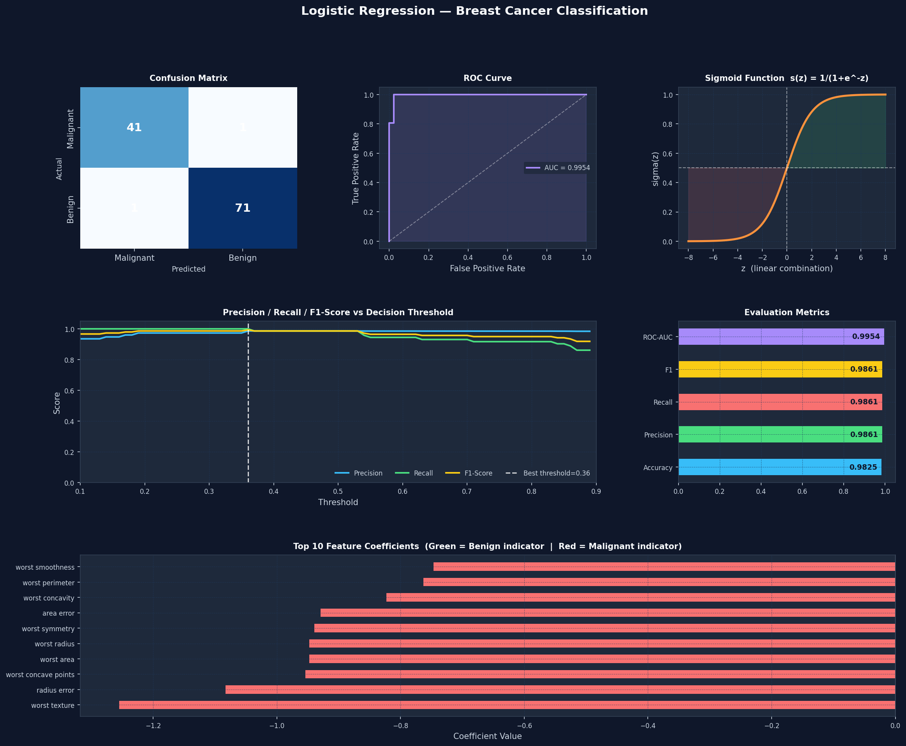

# Task 4 – Binary Classification with Logistic Regression

**AI & ML Internship | Elevate Labs**

---

## Objective
Build a binary classifier using Logistic Regression on the **Breast Cancer Wisconsin Dataset** to predict whether a tumour is *Malignant* or *Benign*.

---

## Tools & Libraries
| Library | Purpose |
|---------|---------|
| `scikit-learn` | Model training, metrics, dataset |
| `pandas` | Data handling |
| `numpy` | Numerical operations |
| `matplotlib` | Plotting |
| `seaborn` | Heatmap (confusion matrix) |

---

## Steps Followed

1. **Dataset** — Loaded Breast Cancer Wisconsin dataset (569 samples, 30 features)
2. **Train/Test Split** — 80 % train / 20 % test, stratified
3. **Standardisation** — `StandardScaler` applied to all features
4. **Model** — `LogisticRegression(max_iter=1000)` from scikit-learn
5. **Evaluation** — Confusion matrix, Precision, Recall, F1-Score, ROC-AUC
6. **Threshold Tuning** — Swept thresholds 0.1 → 0.9 to find optimal F1

---

## Results

| Metric | Score |
|--------|-------|
| Accuracy | **98.25 %** |
| Precision | **98.61 %** |
| Recall | **98.61 %** |
| F1-Score | **98.61 %** |
| ROC-AUC | **99.54 %** |

Optimal decision threshold (max F1): **0.36**

### Confusion Matrix
```
              Predicted
              Malignant  Benign
Actual Malignant   41      1
       Benign       1     71
```

---

## Visualisations

The script produces a single `logistic_regression_results.png` with:

- Confusion Matrix heatmap
- ROC Curve with AUC
- Sigmoid Function plot
- Precision / Recall / F1 vs Threshold
- Evaluation Metrics bar chart
- Top 10 Feature Coefficients



---

## How to Run

```bash
# Clone the repo
git clone https://github.com/BhavyaMathur1/task4-logistic-regression.git
cd task4-logistic-regression

# Install dependencies
pip install scikit-learn pandas matplotlib seaborn

# Run
python logistic_regression_classifier.py
```

---

## Interview Answers

### 1. How does logistic regression differ from linear regression?
Linear regression predicts a **continuous** value; logistic regression predicts a **probability** (0–1) for a class by passing the linear output through the sigmoid function.

### 2. What is the sigmoid function?
`σ(z) = 1 / (1 + e^(-z))` — maps any real number to (0, 1). Used to convert the raw linear score into a class probability.

### 3. What is Precision vs Recall?
- **Precision** = TP / (TP + FP) — of all predicted positives, how many are actually positive?
- **Recall** = TP / (TP + FN) — of all actual positives, how many did we catch?

### 4. What is the ROC-AUC curve?
ROC plots True Positive Rate vs False Positive Rate at every threshold. AUC (Area Under Curve) summarises performance — 1.0 is perfect, 0.5 is random.

### 5. What is the confusion matrix?
A 2×2 table showing TP, TN, FP, FN counts, giving a full picture of classification errors.

### 6. What happens if classes are imbalanced?
Accuracy becomes misleading. Use **F1-Score**, **ROC-AUC**, class weights (`class_weight='balanced'`), or resampling (SMOTE / undersampling).

### 7. How do you choose the threshold?
Default is 0.5, but you can tune it by sweeping values and picking the one that maximises F1, or balances precision/recall for your use case (e.g. higher recall for medical diagnosis).

### 8. Can logistic regression be used for multi-class problems?
Yes — via **One-vs-Rest (OvR)** or **Multinomial** (softmax) strategies, both supported in scikit-learn's `LogisticRegression(multi_class='ovr'/'multinomial')`.
